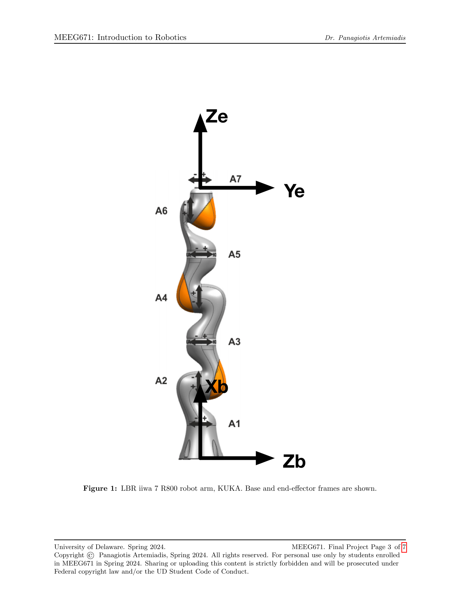
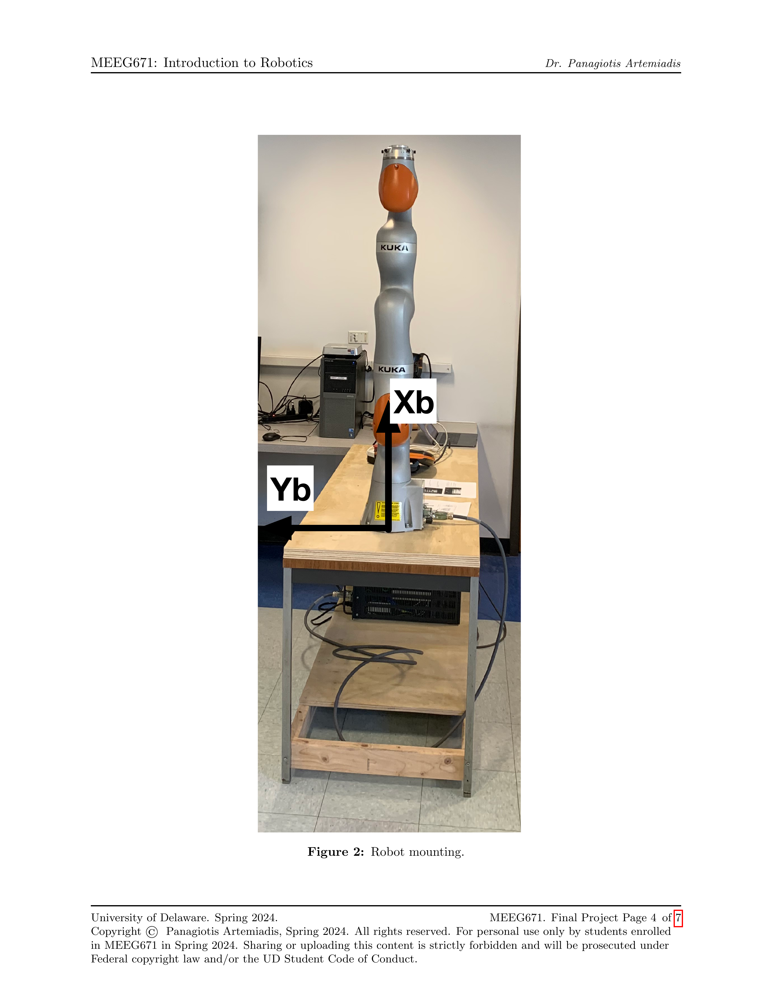
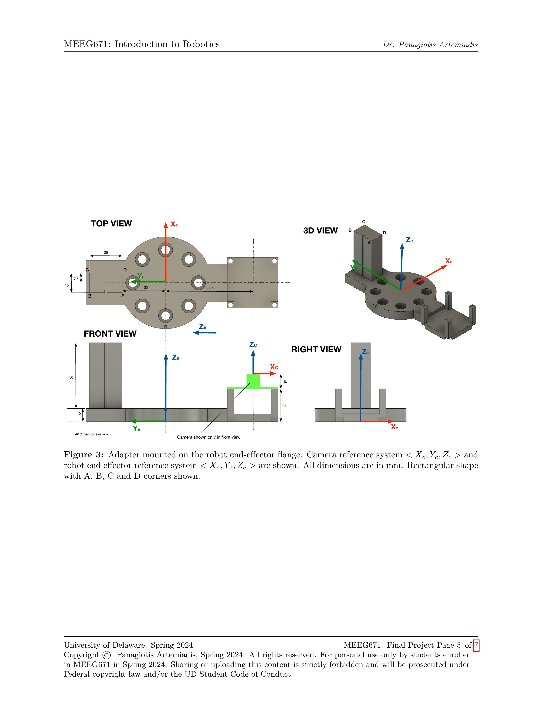

# KUKA LBR iiwa 7 R800 Trajectory Planning

This project implements joint-space trajectory planning for the KUKA LBR iiwa 7 R800 robot to position a rectangular shape precisely over a target using visual feedback from an ArUco marker. The project was developed as a final assignment for the **MEEG671: Introduction to Robotics** course at the University of Delaware.

## 📘 Problem Statement

A 7 degree-of-freedom robot arm (LBR iiwa 7 R800, KUKA) is mounted on a base and equipped with an end-effector holding a rectangular object and a camera. The objective is to generate a smooth joint-space trajectory such that the rectangular shape aligns precisely on top of a printed target on the table, whose pose is inferred using an ArUco marker.

**For full details, refer to the [Problem Description PDF](docs/Problem_Description.pdf).**

### Constraints:

- Use ArUco marker pose estimation for target localization.
- Obey joint position and velocity limits.
- Avoid collisions with the table.
- Total motion duration: **10 seconds**, with final **2 seconds static hold**.
- Output trajectory: 2000 configurations (1 per 5ms).

## 📂 Project Structure

```
ROBO_PROJECT_KUKA/
│
├── code/                   # MATLAB scripts for planning and trajectory generation
│   ├── main.m              # Entry point: computes the full trajectory
│   └── utils/              # Helper functions (aruco parsing, validation)
│
├── output/
│   └── Harshal_Salian.txt  # Final trajectory: 2000x7 matrix (joint angles)
│
├── media/                  # Visuals extracted from problem statement
│   ├── kuka_arm_diagram.png
│   ├── flange_adapter_views.png
│   └── aruco_target_setup.png
│
└── docs/
    └── Problem_Description.pdf  # Original assignment with figures
```

## 🔧 How to Run

1. Open `main.m` in MATLAB.
2. Run the script to:
   - Load initial and camera configurations.
   - Convert ArUco pose to world frame.
   - Generate a collision-free trajectory in joint space.
   - Enforce joint limits.
   - Save 2000-sample output to `Harshal_Salian.txt`.

```matlab
% Example
run('code/main.m')
```

## 🛠 Technical Highlights

- **Trajectory Planning**: Smooth 7-DOF interpolation using constraints.
- **ArUco Integration**: Pose transformation with ZYX Euler angles.
- **Validation**: Ensures safe robot motion with speed & position limits.
- **Output Format**: 8-decimal precision, space-separated joint values.

## 📸 Visuals from Project

| Robot & Frame Setup | Flange Adapter | ArUco Target Capture |
|---------------------|----------------|-----------------------|
|  |  |  |

## 👨‍💻 Author

**Harshal Salian**  
MS Robotics, University of Delaware  
[LinkedIn](https://www.linkedin.com/in/harshal-salian) • [GitHub](https://github.com/Firebl4ze)

## 📄 License

For academic use only. Based on the curriculum of MEEG671 @ UD.
